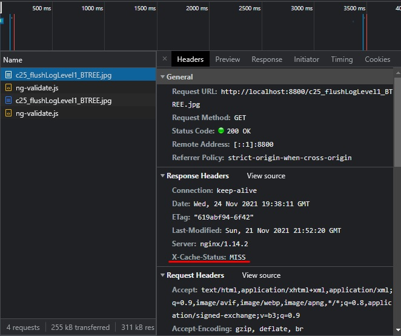
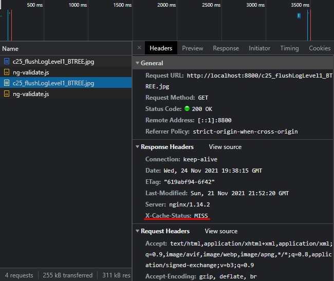
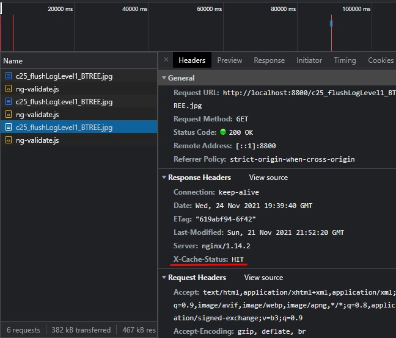
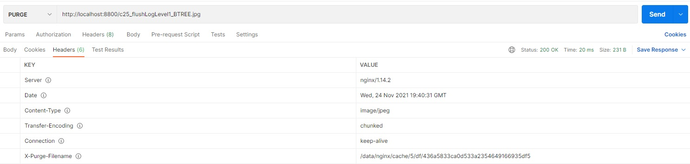
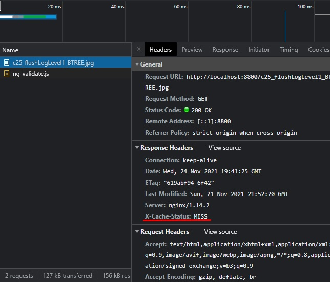

# Run #  
```
docker-compose -f "docker-compose.yml" up -d --build  
```  

## curl --location --request GET 'http://localhost:8800/c25_flushLogLevel1_BTREE.jpg' ##  


  

## curl --location --request PURGE 'http://localhost:8800/c25_flushLogLevel1_BTREE.jpg' ##  
  

## curl --location --request GET 'http://localhost:8800/c25_flushLogLevel1_BTREE.jpg' ##  
  
